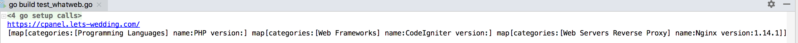

# whatweb
WEB指纹识别 - gowap基础上修改的golang版本

基于[gowap](https://github.com/unstppbl/gowap)项目修改，主要为了适配自己项目需求。

Github目前版本为v1.1, 速度大概为5000网站分析需要3-5分钟。项目版本为v2.2，分析速度单线程，目标量1w，花费25秒，加上并发能够更快。后面再慢慢开源吧。

相对于Python指纹识别，速度有较大幅度提升。

## 使用说明

改为完全离线版本，并且修复gowap中一些小bug带来的识别缺失问题。指纹库来源于[Wappalyzer](https://github.com/AliasIO/Wappalyzer)

主要传入以下数据即可: url, 响应头[list], 网页内容, js返回内容 (目前js返回内容暂未做检测)

传入内容的类型
```
Url		string
Headers	map[string][]string
Html	   string
Jsret    string
```

基本使用:

```
wapp, _ := whatweb.Init("app.json", false)

httpdata := &whatweb.HttpData{}
httpdata.Url = "http://iamstudy.cnblogs.com"
httpdata.Html = ""

headers := "HTTP/1.1 307 Temporary Redirect\npragma: no-cache\n"
httpdata.Headers = wapp.ConvHeader(headers)
res, err := wapp.Analyze(httpdata)
```

其中`wapp.ConvHeader`将字符串转换为map格式

Result:

